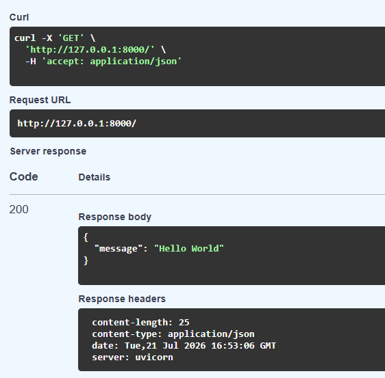
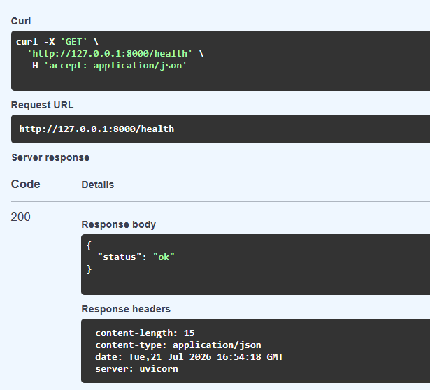
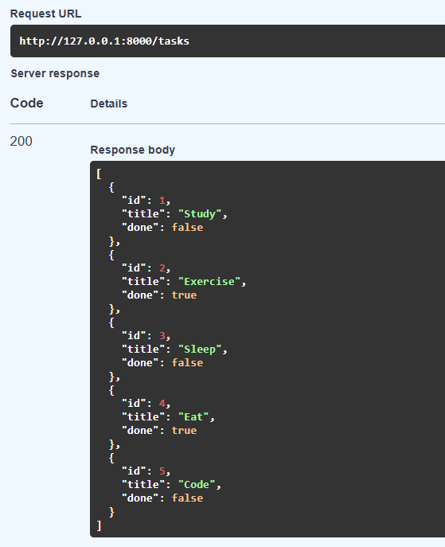
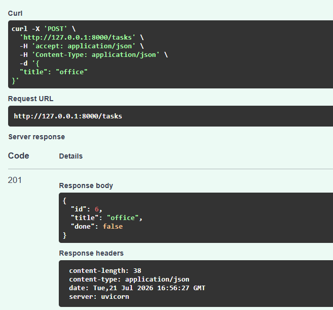
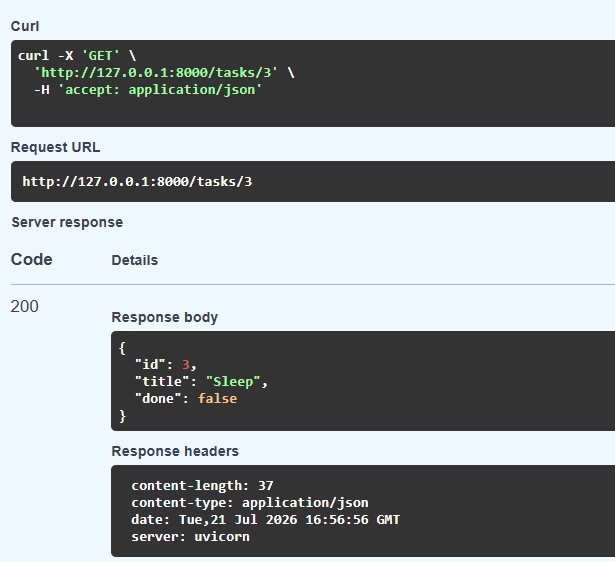
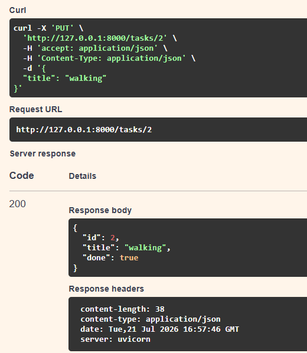
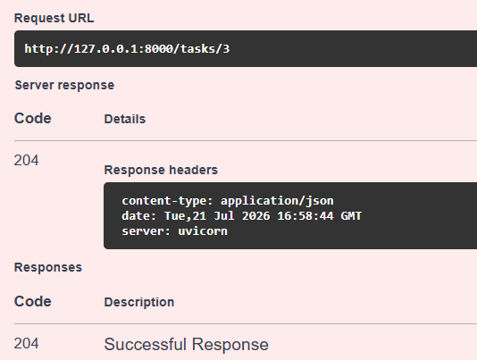

# Task API

A simple RESTful CRUD API built using **FastAPI** that allows users to manage a to-do list. This project was developed as part of the **FlyRank Backend Internship – Week 2 Assignment**.

## Features

- Create a new task
- View all tasks
- View a task by ID
- Update an existing task
- Delete a task
- Built-in Swagger UI for API testing
- In-memory data storage (no database)

---

## Tech Stack

- Python 3
- FastAPI
- Uvicorn
- Pydantic

---

## Installation

### 1. Clone the repository

```bash
git clone https://github.com/Akhileswar6/FlyRank_AI.git
cd week2
```

### 2. Create a virtual environment

```bash
python -m venv venv
```

### 3. Activate the virtual environment

**Windows**

```bash
venv\Scripts\activate
```

**Mac/Linux**

```bash
source venv/bin/activate
```

### 4. Install dependencies

```bash
pip install fastapi uvicorn
```

### 5. Run the application

```bash
uvicorn main:app --reload
```

Server will start at:

```
http://127.0.0.1:8000
```

---

## Swagger Documentation

Interactive API documentation:

```
http://127.0.0.1:8000/docs
```

---
### Swagger UI















---
## API Endpoints

| Method | Endpoint | Description |
|--------|----------|-------------|
| GET | / | API Information |
| GET | /health | Health Check |
| GET | /tasks | Get All Tasks |
| GET | /tasks/{id} | Get Task by ID |
| POST | /tasks | Create Task |
| PUT | /tasks/{id} | Update Task |
| DELETE | /tasks/{id} | Delete Task |

---

## Sample Task Object

```json
{
  "id": 1,
  "title": "Study FastAPI",
  "done": false
}
```

---

## Example Request

### Create a Task

**POST** `/tasks`

```json
{
  "title": "Buy Milk"
}
```

### Response

```json
{
  "id": 4,
  "title": "Buy Milk",
  "done": false
}
```

Status Code:

```
201 Created
```

---

## Project Structure

```
task-api/
│── app/
│   ├── main.py
│   └── data.py
│
├── README.md
├── requirements.txt
└── .gitignore
```

---

## Testing

You can test the API using:

- Swagger UI
- Postman
- curl

Example:

```bash
curl -X GET http://127.0.0.1:8000/tasks
```

---

## Status Codes

| Code | Meaning |
|------|---------|
| 200 | OK |
| 201 | Created |
| 204 | No Content |
| 400 | Bad Request |
| 404 | Not Found |

---

## Future Improvements

- Connect with PostgreSQL
- User Authentication
- Task Categories
- Task Due Dates
- Persistent Database Storage

---

## Author

Developed by **Akhil** as part of the **FlyRank Backend Internship – Week 2 Assignment**.
