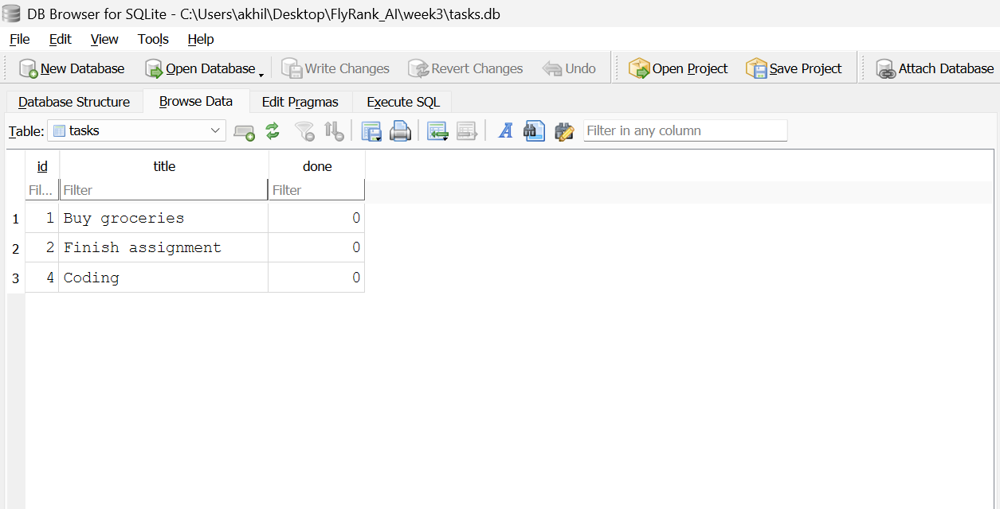

# Task API - Database Integration

A simple RESTful CRUD API built using **FastAPI** that allows users to manage a to-do list, now connected to a persistent **SQLite database**. This project was developed as part of the **FlyRank Backend Internship – Week 3 Assignment**.

## Features

- Create a new task
- View all tasks
- View a task by ID
- Update an existing task
- Delete a task
- Built-in Swagger UI for API testing
- **Persistent Database Storage (SQLite)**: Data survives server restarts!

---

## Tech Stack

- Python 3
- FastAPI
- Uvicorn
- Pydantic
- **SQLite3** (Built-in standard library)

---

## Installation & Setup

### 1. Clone the repository

```bash
git clone https://github.com/Akhileswar6/FlyRank_AI.git
cd week3
```

### 2. Create a virtual environment

```bash
python -m venv venv
```

### 3. Activate the virtual environment

**Windows**

```bash
venv\Scripts\activate
```

**Mac/Linux**

```bash
source venv/bin/activate
```

### 4. Install dependencies

```bash
pip install -r requirements.txt
```

### 5. Run the application

```bash
uvicorn main:app --reload
```

Server will start at:

```
http://127.0.0.1:8000
```
*(The SQLite database `tasks.db` will be created automatically upon startup if it does not already exist!)*

---

## Database Details

### Why SQLite?
SQLite was chosen because it is a lightweight, serverless database that stores all data in a single file on disk. This requires zero setup or installation compared to full database servers like PostgreSQL or MySQL.

### Where is the database stored?
The database is stored in a file named `tasks.db` within the `week3` directory. Because it's managed via `sqlite3` in Python, the file is automatically generated the first time the server spins up.

### Database Screenshot
Here is a view of our tasks directly from DB Browser for SQLite:




### Example SQL Query
During Stage 4, this query was executed manually to list all tasks in the database:
```sql
SELECT * FROM tasks;
```
It instantly retrieved the 3 seeded tasks along with any new tasks added via the API!

---

## Swagger Documentation

Interactive API documentation:

```
http://127.0.0.1:8000/docs
```

---

## API Endpoints

| Method | Endpoint | Description |
|--------|----------|-------------|
| GET | / | API Information |
| GET | /health | Health Check |
| GET | /tasks | Get All Tasks |
| GET | /tasks/{id} | Get Task by ID |
| POST | /tasks | Create Task |
| PUT | /tasks/{id} | Update Task |
| DELETE | /tasks/{id} | Delete Task |
| GET | /stats | Task Statistics |

---

## Project Structure

```
task-api/
│── week3/
│   ├── main.py
│   ├── database.py
│   ├── requirements.txt
│   ├── tasks.db (auto-generated)
│   └── README.md
```

---

## Testing

You can test the API using:

- Swagger UI
- Postman
- curl

Example:

```bash
curl -X GET http://127.0.0.1:8000/tasks
```

---

## Status Codes

| Code | Meaning |
|------|---------|
| 200 | OK |
| 201 | Created |
| 204 | No Content |
| 400 | Bad Request |
| 404 | Not Found |

---

## Author

Developed by **Akhil** as part of the **FlyRank Backend Internship – Week 3 Assignment**.
